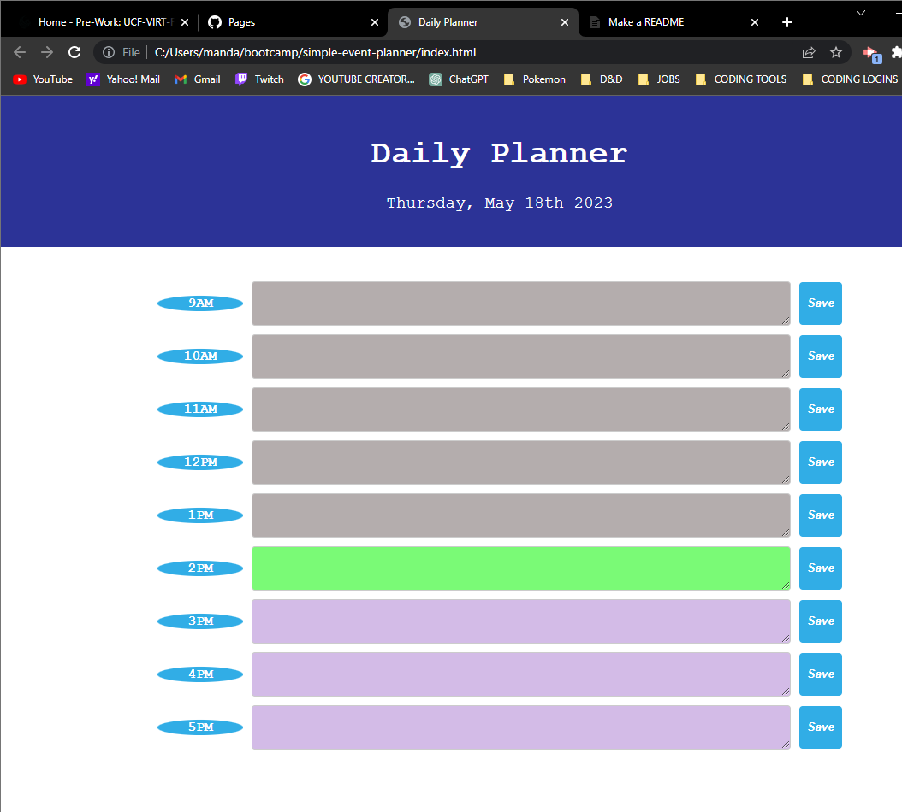

# Simple-event-planner

<a href="">Simple Planner</a>

## Description

The application here will provide a time and date at the top element. Below is a real time check on the hour using moment.js and jQuery APIs to limit the need for extensive code. The event planner will differentiate between past, present and future with color coded background. All events typed into the textarea can be saved into local storage.

## Usage

Many people would be able to organize a business using something simple like this implemnted into their own personal desktop. maybe a company can impliment code like mine into a business end type software that manages the business.

## Credits

Thank you for taking your time,

Alec Gomez

## License
MIT License
